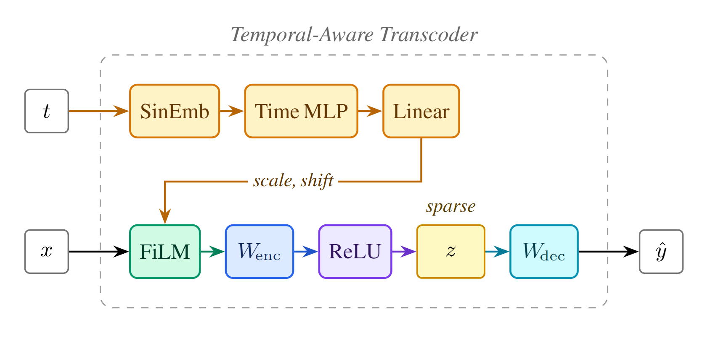
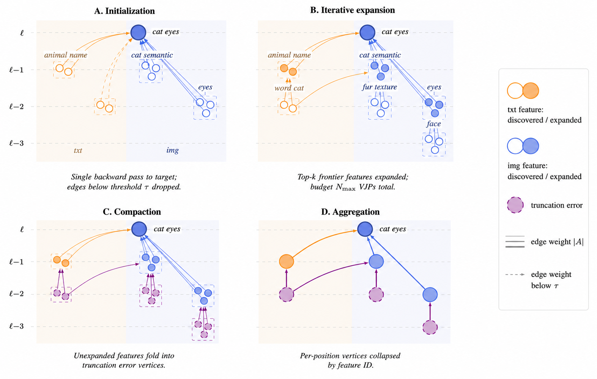

# DifFRACT: Diffusion Feature Reconstruction and Attribution for Circuit Tracing

<a href="TODO"></a>
<a href="https://huggingface.co/Artalmaz31/DifFRACT"></a>
<a href="https://colab.research.google.com/github/TODO/blob/main/walkthrough.ipynb"></a>
<a href="./LICENSE"></a>

<p align="center">
  
</p>

This is the code accompanying the paper *DifFRACT: Diffusion Feature Reconstruction and Attribution
for Circuit Tracing* ([PDF](TODO)). It targets a multimodal diffusion transformer (MM-DiT) with two
residual streams — an **image** stream and a **text** stream — so every transcoder, feature and
graph node is tagged with the stream it belongs to.

This repository contains tools for understanding what happens inside the
[FLUX.1[schnell]](https://huggingface.co/black-forest-labs/FLUX.1-schnell) text-to-image
diffusion transformer by using **timestep-conditioned transcoders**. A transcoder decomposes
an MLP sublayer into a sparse linear combination of interpretable features; conditioning it on
the denoising timestep lets a single transcoder track how a feature's behaviour changes across
the diffusion trajectory. By substituting transcoders into a frozen **Local Replacement Model**,
we can extract fine-grained **attribution graphs** — the circuits of features that produce a
given behaviour — and intervene on them.

<p align="center">
  
</p>

## Quick start

1. Install the dependencies:

   ```bash
   pip install -r requirements.txt
   ```

2. Authenticate to the Hugging Face Hub (FLUX.1-schnell is gated) and download the trained
   weights from [`Artalmaz31/DifFRACT`](https://huggingface.co/Artalmaz31/DifFRACT), then
   point `TRANSCODERS_DIR` at the directory holding the `transcoder_{stream}_{layer}.pt`
   checkpoints:

   ```bash
   huggingface-cli login
   huggingface-cli download Artalmaz31/DifFRACT --repo-type model --local-dir weights
   export TRANSCODERS_DIR=weights/temporal-aware-transcoders
   ```

   The release holds 40 checkpoints: the 34 timestep-conditioned transcoders
   (`temporal-aware-transcoders/`, image and text streams for layers 0–15 and 18) used by the
   walkthrough and case studies, plus the 6 SAE baselines (`temporal-aware-saes/`, layers 6/12/18)
   for the sparsity–faithfulness comparison.

3. Work through [`walkthrough.ipynb`](walkthrough.ipynb): it loads FLUX, builds the Local
   Replacement Model, traces and prunes a circuit for one feature, renders the interactive
   attribution graph, and runs a circuit-guided intervention end to end.

To train the timestep-conditioned transcoders yourself (MLP **input → output** reconstruction), run:

```bash
python train_transcoder.py --layers $(seq 0 15) --save-dir ./output
```

Key flags: `--layers` (double-stream block indices, both `img` and `txt` streams trained per layer;
default `6 12 18`), `--save-dir` (checkpoint output dir), `--dataset-id` (HF prompt corpus, default
`yvdao/midjourney-v6`), `--l1-img` / `--l1-txt` (sparsity coefficients, default `3e-4` / `5e-5`),
`--cycles`, `--buffer-size`, `--batch-size`, `--device`. Checkpoints are written to
`{save-dir}/best/transcoder_{stream}_{layer}.pt` (best by validation cosine) and `{save-dir}/last/`;
point `TRANSCODERS_DIR` at `{save-dir}/best` to use them.

To train the SAE baseline (identical architecture, but autoencodes the MLP **output → output**, so
its reconstruction error is comparable to a transcoder's), run:

```bash
python train_sae.py --layers 6 12 18 --save-dir ./output_sae
```

It takes the same flags and writes `{save-dir}/best/sae_{stream}_{layer}.pt`.

## Examples

Each notebook reproduces one steering experiment from the paper:

* [`case_study_color_prior.ipynb`](case_study_color_prior.ipynb): mitigating semantic color
  priors — suppressing only the image-stream color feature versus also suppressing its
  associative text-stream context sources (which only the graph exposes).
* [`case_study_concept_context.ipynb`](case_study_concept_context.ipynb): concept versus context
  steering — features that fire on the concept tokens themselves versus features that fire on
  semantically related context, with matched feature counts for a fair comparison.
* [`case_study_suppressor.ipynb`](case_study_suppressor.ipynb): suppressor features — a
  text-stream feature that suppresses a competing concept in the target's circuit.
* [`case_study_temporal.ipynb`](case_study_temporal.ipynb): the temporal evolution of an
  attribution graph — how the image- and text-stream attribution shares shift across the four
  denoising steps, with interactive per-step graphs and a causal stepwise-suppression check.

The two libraries used by these notebooks, [`transcoder_training/`](transcoder_training/) and
[`transcoder_circuits/`](transcoder_circuits/), each carry a short README describing their modules.

## Citation

If our work assists your research, feel free to give us a star ⭐ or cite us using:

```bibtex
@article{diffract2026,
  title   = {DifFRACT: Diffusion Feature Reconstruction and Attribution for Circuit Tracing},
  author  = {TODO},
  journal = {TODO},
  year    = {2026}
}
```
